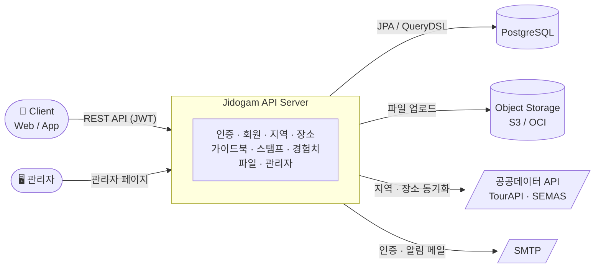

# 🗺️ 지도감 (Jidogam) — Backend

> 동네를 여행하듯 탐방하는 지역 기반 가이드북 & 스탬프 투어 서비스의 백엔드 서버

[](https://openjdk.org/)
[](https://spring.io/projects/spring-boot)
[](https://www.postgresql.org/)
[](https://flywaydb.org/)
[](https://www.docker.com/)
[](https://github.com/Re-Gion-Jidogam/Jidogam-back/actions/workflows/pr-build-and-test.yml)

---

## 소개

**지도감**은 익숙하지 않은 동네도 여행하듯 둘러볼 수 있도록 돕는 서비스입니다. 사용자는 관심 지역의 상가·가게 정보를 둘러보고, 마음에 든 장소들을 엮어 **가이드북**을
만들어 공유하고, 실제로 방문한 곳에는 **스탬프**를 남깁니다. 이런 활동은 **경험치**로 쌓여 동네 탐방을 게임처럼 즐길 수 있게 합니다.

이 저장소는 지도감 서비스의 REST API 서버로, 회원/인증부터 지역 데이터, 장소, 가이드북, 스탬프, 경험치, 파일 업로드, 운영자용 관리 도구까지 서비스 전반의 백엔드
로직을 담당합니다.

## 아키텍처



## 주요 기능

### 🔑 인증 & 회원 (`auth`, `user`)

이메일 인증 기반 회원가입, JWT Access/Refresh Token을 이용한 로그인·재발급·로그아웃, 비밀번호 재설정 메일 발송을 지원합니다. 회원 탈퇴 시 즉시 삭제하지
않고 소프트 삭제 후 복구할 수 있도록 설계했습니다.

### 🗾 지역 정보 (`area`)

한국관광공사 TourAPI의 법정동코드(ldongCode2)를 기반으로 시/도 - 시/군/구 계층 구조를 구성합니다. 행정구역 개편으로 코드가 바뀌더라도 이전 데이터를 조회할 수
있도록 레거시 코드 매핑(효력 발생일 포함)을 관리하며, 지역별로 '관심 지역'·'취약 지역' 등 가중치를 두어 경험치 산정에 활용합니다.

### 📍 장소 (`place`)

소상공인시장진흥공단(SEMAS) 공공데이터 API를 기반으로 상가업소 정보를 관리합니다. 사용자가 주변 장소를 조회하면 필요한 지역 데이터를 실시간으로 동기화해 최신 정보를
유지하고, 인기 장소 목록도 제공합니다.

### 📖 가이드북 (`guidebook`)

사용자가 직접 여러 장소를 묶어 동네 가이드북을 작성·수정·삭제하고, 최소 등록 장소 수 등 조건을 만족하면 출판해 다른 사용자와 공유할 수 있습니다. 출판된 가이드북에는 참여,
리뷰 작성/수정/삭제가 가능하며, 관리자가 부적절한 가이드북을 숨김 처리할 수 있습니다.

### 🏅 스탬프 (`stamp`)

사용자가 실제 방문한 장소에 스탬프를 적립합니다. 동일 장소에 대한 과도한 스탬프 적립을 막기 위해 쿨타임 정책을 두었습니다.

### ⭐ 경험치 (`exp`)

스탬프 적립, 가이드북 출판/완주 등 사용자 활동에 따라 경험치를 지급합니다. 지역 가중치와 가이드북 완주율 등을 반영해 경험치를 계산합니다.

### 🗂️ 파일 (`File`)

프로필 이미지, 가이드북 사진 등 첨부 파일을 업로드/다운로드합니다. 저장소를 로컬 디스크, AWS S3, OCI Object Storage 중 환경 설정만으로 전환할 수 있도록
추상화했습니다.

### 🛠️ 관리자 (`admin`)

Thymeleaf 기반 관리자 페이지와 API를 통해 회원, 가이드북, 상가업소 데이터를 관리합니다. 관리자 조치는 이력으로 남겨 추적할 수 있습니다.

## 기술적으로 신경 쓴 부분

- **공통 응답/페이지네이션 표준화**: 모든 API가 공통 응답 포맷(`ResponseDto`)과 커서 기반 페이지네이션(`Cursor`, `CursorCodecUtil`)을
  사용하도록 통일했습니다.
- **전역 예외 처리**: 도메인별 예외와 에러 코드(`ErrorCode`)를 정의하고 `GlobalExceptionHandler`에서 일관된 에러 응답으로 변환합니다.
- **외부 공공데이터 연동의 안정성**: 한국관광공사 TourAPI(지역)·SEMAS(장소) 공공데이터 API 호출 실패를 재시도(spring-retry)하고, 실패 이력을 별도
  테이블에 기록해 추적할 수 있도록 했습니다.
- **스토리지 전략 추상화**: local / AWS S3 / OCI Object Storage를 하나의 인터페이스로 다루어, 배포 환경에 따라 설정값만으로 저장소를 교체할 수
  있습니다.
- **행정구역 데이터 마이그레이션**: 행정구역 개편에 대응하기 위해 Flyway 마이그레이션으로 지역 계층 구조를 재설계하고 레거시 코드를 별도로 관리합니다.
- **인증 컨텍스트 주입**: `@CurrentUserId` 커스텀 어노테이션과 `ArgumentResolver`로 컨트롤러에서 JWT의 사용자 식별자를 간편하게 사용할 수
  있도록 했습니다.

## 기술 스택

| 영역                 | 스택                                                                                                         |
|--------------------|------------------------------------------------------------------------------------------------------------|
| Language / Runtime | Java 17                                                                                                    |
| Framework          | Spring Boot 3.5, Spring Web, Spring Data JPA, Spring Security, Spring Validation, Spring Retry, Spring AOP |
| Database           | PostgreSQL, Flyway(마이그레이션), H2(테스트)                                                                        |
| Query              | QueryDSL 5.0                                                                                               |
| 인증                 | JWT (nimbus-jose-jwt)                                                                                      |
| 매핑/보일러플레이트         | MapStruct, Lombok                                                                                          |
| 문서화                | springdoc-openapi (Swagger UI)                                                                             |
| 파일 저장소             | AWS S3 SDK v2, OCI Object Storage                                                                          |
| 메일                 | Spring Mail (SMTP)                                                                                         |
| 관리자 화면             | Thymeleaf                                                                                                  |
| 모니터링               | Spring Actuator                                                                                            |
| 인프라/배포             | Docker (멀티 스테이지 빌드), GitHub Actions (빌드/테스트, 이미지 빌드·푸시, 배포)                                                |

## 패키지 구조

패키지는 크게 `common`(전역 설정/공통 유틸), `domain`(도메인별 컨트롤러·서비스·엔티티), `infrastructure`(외부 시스템 연동)로 나뉩니다.

```
src/main/java/region/jidogam
├── common/            # 전역 설정, 예외 처리, 커서 페이지네이션, 인증 컨텍스트 등 공통 모듈
├── domain/            # auth, user, area, place, guidebook, stamp, exp, File, admin
└── infrastructure/
    ├── security/      # Spring Security, 인증/인가 설정
    ├── jwt/           # JWT 발급/검증
    ├── area/          # 외부 지역 공공데이터 API 연동
    ├── place/         # 외부 장소 공공데이터 API 연동
    ├── objectstorage/ # 저장소 전략(local/S3/OCI) 추상화
    └── s3/            # AWS S3 클라이언트 설정
```

## CI/CD

GitHub Actions로 PR 생성 시 빌드·테스트를 자동 실행하고, `main` 브랜치에 반영되면 Docker 이미지 빌드부터 운영 서버 배포까지 자동화했습니다. 이슈/PR
템플릿을 갖춰 작업 유형을 구분해 관리하고 있습니다.


